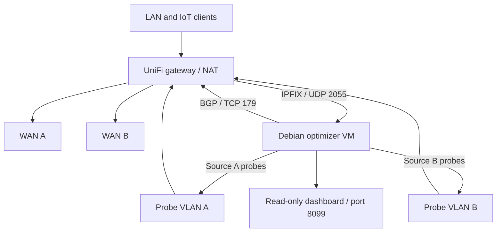

# Route Optimizer

A **self-hosted, experimental dual-WAN outbound route optimizer** for a UniFi gateway using **IPFIX, active path measurements and BGP**. Includes a read-only, dark-themed web dashboard with historical ISP quality, optimizer health and route-change history.

> **Caution:** Research / homelab software, **not an officially supported UniFi feature or a drop-in replacement for Noction/SD-WAN**. A BGP next-hop change can reset existing sessions because NAT exits through a different public IP. **Dry-run is the default**. Review routing safeguards and a rollback plan before `--apply`.

## What it does

- Receives exported flow records with `nfcapd` / `nfdump` (IPFIX v10), identifies visited public IPv4 `/24` networks and measures up to three representative hosts per prefix via two separately policy-routed probe VLANs.
- Scores response time, jitter and probe loss, with consecutive wins, a quiet-flow interval, route hold-down and inactivity expiration to avoid unnecessary changes.
- Uses ExaBGP to inject eligible public `/24` routes into the gateway with a WAN gateway as the third-party next-hop. The optimizer VM is **not** inline and does not forward user traffic.
- Exposes a **read-only** web UI with IPFIX and BGP health, active optimizer-managed routes, destination decisions and quality graphs (HTTP on port 8099).
- Keeps records across restarts in local JSON state; maintains bounded quality and route-event history.

Current implementation expects exactly two ISP labels, `FRONTIER` and `SPECTRUM` (used as friendly labels in the code/dashboard). These are **labels**, not integration requirements. Rename the labels consistently in code if you use different ISPs. Internet traffic must be NATed by the gateway on each selected WAN.

## Architecture



## Prerequisites

- A UniFi gateway with IPFIX export and an accessible FRR/BGP implementation supporting **third-party next-hop** routes as demonstrated in our test environment. **Do not assume other gateway models/firmware work**; prove route acceptance and forwarding on your model before enabling automatic route changes.
- Debian or equivalent Linux VM with management IP, two dedicated probe interfaces/VLANs and policy routes steering each probe source out a different ISP. Apply a **WAN policy route with a kill switch** per probe VLAN to avoid accidentally sampling the wrong provider during failures.
- `python3` 3.11+, `nfdump` (including `nfcapd`), `iputils-ping`, `exabgp`, `tcpdump` for troubleshooting. Only standard-library Python packages are required by the optimizer and dashboard.
- Working ExaBGP iBGP session with UCG, configured **inbound BGP route-map/prefix-list** that rejects internal/special-use networks and other unsafe routes; **neighbor maximum-prefix greater than optimizer cap** (for example, 75 with an optimizer limit of 50).
- An SSH or console recovery plan before changing routes. UniFi firmware updates/config regeneration may overwrite unsupported FRR CLI edits.

**Performance warning:** Enabling NetFlow/IPFIX export can disable hardware acceleration on some UniFi gateways and noticeably reduce throughput. Benchmark wired throughput and CPU usage before relying on continuous export. Never point the collector to the Internet.

## Installation (new deployment)

1. Set up a **static management address** on the Debian VM, two probe VLAN interfaces, their source-routing rules and UniFi VLAN→WAN policy routes. Start from [`examples/network-interfaces.example`](examples/network-interfaces.example), adapting the interface names and topology. Check `ip rule` and both policy tables after reboot.
2. Configure UniFi IPFIX v10 to export your production LAN/VLAN flows to the VM UDP 2055. Exclude the probe VLANs if possible to avoid feedback. Confirm `tcpdump -ni <management-interface> udp port 2055` receives packets.
3. Install and configure ExaBGP with [`examples/exabgp.conf.example`](examples/exabgp.conf.example); validate its session is **Established** using `sudo exabgp-cli 'show neighbor summary'`.
4. Customize [`examples/unifi-bgp.conf.example`](examples/unifi-bgp.conf.example) and upload/import it using your UniFi gateway's supported BGP/FRR configuration-file workflow. **Do not upload unchanged**: replace the sample ASN, router ID and optimizer peer IP, and add explicit deny entries for **each real WAN-connected subnet** before the public-prefix permit. The example provides an inbound route-map accepting only eligible public `/24`–`/32` destinations plus a `maximum-prefix 75` backstop (for a 50-route optimizer ceiling). If the UniFi importer replaces the full routing configuration, merge these BGP statements into your existing FRR config first so OSPF or unrelated BGP settings are preserved. Validate import behavior on your gateway model/firmware; the example alone does not establish compatibility.
5. Copy and customize the **untracked** site configuration; **do not publish actual gateway/public WAN addresses**:

```bash
sudo mkdir -p /etc/route-optimizer /opt/route-optimizer /var/lib/route-optimizer
sudo install -m 0600 examples/config.example.json /etc/route-optimizer/config.json
sudoedit /etc/route-optimizer/config.json
sudo install -m 0755 src/route-optimizer.py /opt/route-optimizer/route-optimizer.py
sudo install -m 0755 src/route-optimizer-web.py /opt/route-optimizer/route-optimizer-web.py
sudo install -m 0644 systemd/route-optimizer.service /etc/systemd/system/route-optimizer.service
sudo install -m 0644 systemd/route-optimizer-web.service /etc/systemd/system/route-optimizer-web.service
sudo systemctl daemon-reload
sudo systemctl enable --now route-optimizer route-optimizer-web
```

The example JSON uses **RFC 5737 documentation addresses** (`198.51.100.0/24`, `203.0.113.0/24`) as pretend WANs. **Replace every address and subnet** with your own site values. `wan_connected_networks` must include each ISP next-hop and is also excluded from possible route announcements. Source IPs must match your actual probe interfaces. `own_ips` must include the optimizer management and both probe IPs. The internal networks list should cover all production VLANs included in IPFIX.

To view logs:

```bash
sudo journalctl -u route-optimizer -f
sudo systemctl status route-optimizer route-optimizer-web --no-pager
```

The dashboard listens on `127.0.0.1:8099` by default. Tunnel with `ssh -L 8099:127.0.0.1:8099 user@optimizer-host`, or bind it to a **trusted management address** behind an access-controlled reverse proxy (edit the systemd web unit via a drop-in). It has **no built-in authentication**; don't expose it publicly.

## Dry-run, live mode and rollback

The provided service unit **does not contain `--apply`** and never announces route changes. Run the engine manually in dry-run mode for several hours before live routing:

```bash
sudo /opt/route-optimizer/route-optimizer.py --config /etc/route-optimizer/config.json --watch 60 --top 50
```

**Before live:** Verify BGP session, the inbound prefix filter, neighbor max-prefix, both WAN probes and their kill switches, old optimizer routes removed, and no stale state. Be aware that switching a `/24` can terminate existing TCP/UDP/QUIC connections. Quiet-flow detection uses delayed flow exports, not authoritative conntrack state.

To enable, create a systemd override for `route-optimizer.service` to add `--apply` to `ExecStart`, then `systemctl daemon-reload && systemctl restart route-optimizer`. Do **not** enable route changes via the web service. Watch `show ip route bgp` on the gateway and audit the dashboard's route history.

**Emergency rollback** (stops new changes, withdraws only prefixes tracked in optimizer state):

```bash
sudo systemctl stop route-optimizer
sudo /opt/route-optimizer/route-optimizer.py --config /etc/route-optimizer/config.json --withdraw-all --apply
# Then verify on UCG: vtysh -c 'show ip route bgp'
```

Routes manually announced outside this state file are **not** removed by `--withdraw-all`. If ExaBGP has already lost track of its dynamic announcements, verify and clean up routes on the UCG itself. Keep a copy of state until withdrawal is confirmed.

## Limitations and safety

- **Outbound IPv4 only**; does not influence inbound routing or IPv6. IPv4 `/24` is a deliberate choice and may affect multiple services at once.
- Path quality is measured against currently visited hosts. ICMP/TCP probing cannot perfectly model application performance, long-lived sessions, UDP or QUIC.
- Only compares WANs that the **UniFi policy routes** actually send probes over. A misconfigured probe VLAN invalidates measurements.
- The app is not an authoritative inventory of the UCG FIB; "installed" indicates locally tracked/acknowledged optimizer BGP announcements. Compare to `vtysh` for actual installation.
- Local JSON state, IPFIX records and traffic history may contain private network usage metadata. Keep them out of Git; `config.json`, `nfcapd.*`, JSON state files and logs are ignored.
- If the WAN gateway changes dynamically, update site config, safe prefix filters and next-hop handling before attempting live optimization.
- BGP maximum-prefix is a **backstop** and may reset the neighbor if exceeded; do not treat it as a normal route-management mechanism.

## Tests

```bash
python3 -m unittest discover -s tests -v
python3 -m py_compile src/route-optimizer.py src/route-optimizer-web.py
```

GitHub Actions runs the standard-library unit tests on push and pull request. More model-specific integration/forwarding tests are needed before treating this as a production-grade router optimizer.

## License

MIT. See [LICENSE](LICENSE). Contributions, issues and constructive testing reports are welcome.

## Migrating an existing pre-public-release v3.3 deployment

The GitHub-ready code deliberately **removed hardcoded site IPs**. It is therefore **not a drop-in replacement for a running v3.3 service** until you have created `/etc/route-optimizer/config.json` with your actual local WAN gateway IPs, probe IPs, export address and protected subnets. Do not copy your private config, IPFIX captures, current state or log files into the public repository. Back up the working script and state before any upgrade. Once the local config exists, validate dry-run first; keep your original systemd and reverse-proxy overrides until the new code behaves correctly.